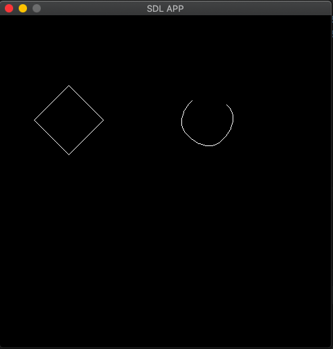

### C++ implementation of Chaikin's Algorithm

#### The algorithm divides the straight lines into smaller one to form a curve (accuracy raises with number of iteration)

### the algorithm currently is slow as I used LinkedList and basic, basic techniques to implement it quickly.

## Dependencies 
SDL, was used to draw the points, you can edit the library